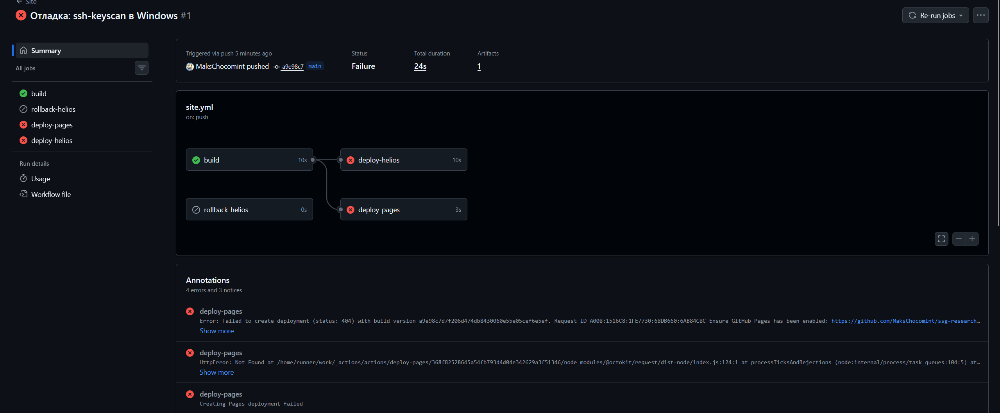

# Отладка

## 1. Forbidden на Helios

**Ошибка.** По адресу `https://se.ifmo.ru/~s564789/` браузер показывал:

```text
Forbidden
You don't have permission to access this resource.
```

**Гипотеза.** Не хватает прав на домашний каталог или на `public_html` — веб-сервер
не может прочитать файлы.

**Проверка.** Посмотрел настройки Apache и права:

```bash
cat /usr/local/etc/apache24/Includes/userdir.conf
ls -ld ~ ~/public_html ~/public_html/index.html
```

В конфиге `UserDir public_html` и доступ открыт для `/home/*/*/public_html`, права на
домашний каталог `drwxr-xr-x` — нормальные. А `ls` ответил
`public_html: Нет такого файла или каталога`: каталога просто не было.

**Решение.** Создал каталог и тестовую страницу:

```bash
mkdir -p ~/public_html && chmod 755 ~/public_html
echo "helios-test-ok" > ~/public_html/index.html && chmod 644 ~/public_html/index.html
```

После этого страница открылась. Вывод: Apache возвращает 403, а не 404, когда
у пользователя нет `public_html`.

## 2. `uv` не распознан в PowerShell

**Ошибка.**

```text
uv : Имя "uv" не распознано как имя командлета, функции, файла сценария или выполняемой программы.
```

**Гипотеза.** uv не установлен или его нет в `PATH`.

**Проверка.** `uv.exe` лежит в `C:\Users\maxpr\.local\bin`, и этот каталог уже есть
в пользовательской переменной `Path`. Значит, дело в том, что терминал VS Code был
открыт до установки uv и получил старое окружение.

**Решение.** Перезапустить VS Code (или обновить `$env:Path` в текущей сессии).

## 3. `ssh-keyscan` в Windows не получает ключ сервера

**Ошибка.** Для секрета `HELIOS_KNOWN_HOSTS` нужен ключ сервера. Команда в PowerShell
ничего не вернула:

```text
PS> ssh-keyscan -p 2222 helios.cs.ifmo.ru
# helios.cs.ifmo.ru:2222 SSH-2.0-OpenSSH_10.0 FreeBSD-20250801
choose_kex: unsupported KEX method sntrup761x25519-sha512@openssh.com
```

**Гипотеза.** Встроенный в Windows OpenSSH (9.5, собран с LibreSSL) предлагает серверу
алгоритм обмена ключами `sntrup761x25519-sha512`, но сам его не поддерживает. Обычный
`ssh` при этом подключается, потому что выбирает другой алгоритм (`curve25519-sha256`,
видно в `ssh -v`).

**Проверка.** Запустил `ssh-keyscan` из Git Bash, там OpenSSH 10.0 на OpenSSL:

```bash
ssh-keyscan -t ed25519 -p 2222 helios.cs.ifmo.ru > helios_kh
ssh-keygen -lf helios_kh
# 256 SHA256:3n1x6Bq0hnfyxrWB/YeQQPaxUkE/GCX2vKKtl0nzGgM [helios.cs.ifmo.ru]:2222 (ED25519)
```

Ключ получен, отпечаток совпадает с тем, что показывал SSH при первом ручном входе.

**Решение.** В секрет записана строка `[helios.cs.ifmo.ru]:2222 ssh-ed25519 AAAA…` из
Git Bash. Такую же строку можно взять из своего `~/.ssh/known_hosts` после ручного входа
с проверкой отпечатка.

## 4. `deploy-pages`: Failed to create deployment (status: 404)

**Ошибка.** Первый запуск после push: сборка прошла, а job `deploy-pages` упал:

```text
Error: Failed to create deployment (status: 404) with build version a9e98c7...
Ensure GitHub Pages has been enabled: https://github.com/MaksChocomint/ssg-research-site/settings/pages
HttpError: Not Found
```



**Гипотеза.** Pages в репозитории не включён, поэтому API GitHub не знает, куда публиковать
артефакт, и отвечает 404. Сам артефакт (`upload-pages-artifact`) загрузился нормально.

**Проверка.** Открыл **Settings → Pages**: источник публикации не был выбран.

**Решение.** Выбрал **Source = GitHub Actions** и перезапустил упавшие jobs
(**Re-run failed jobs**). Второй попыткой `deploy-pages` прошёл, healthcheck подтвердил
версию `a9e98c7` на `https://makschocomint.github.io/ssg-research-site/`.

## 5. Формула выводится как текст

**Ошибка.** После добавления локального MathJax формула на странице «Ход работы»
отображалась исходным текстом:

```text
\[ W = W_{\text{site}} + \sum_{i=1}^{n} W_{\text{ext},i} \tag{1} \label{eq:weight} \]
```

Ссылка `\eqref{eq:weight}` в тексте тоже осталась как есть.

**Гипотеза.** MathJax загрузился (до этого формула в окружении `equation` отрисовалась),
но не распознаёт разделители `\[ … \]`, то есть ошибка в файле настройки.

**Проверка.** Открыл опубликованный `javascripts/mathjax.js`:

```js
displayMath: [["\[", "\]"]],
```

В JavaScript строка `"\["` — это просто `[`: обратный слеш пропал при создании файла
через heredoc в терминале. MathJax искал формулы между обычными квадратными скобками.
Формула в окружении `equation` отрисовывалась только благодаря `processEnvironments`.

**Решение.** Исправил строки на `"\\["` и `"\\]"` (так в JS получается `\[`) и проверил
результат через Node.js. Ссылку на формулу обернул в `$…$`, иначе arithmatex её не
размечает и MathJax её не обрабатывает.

