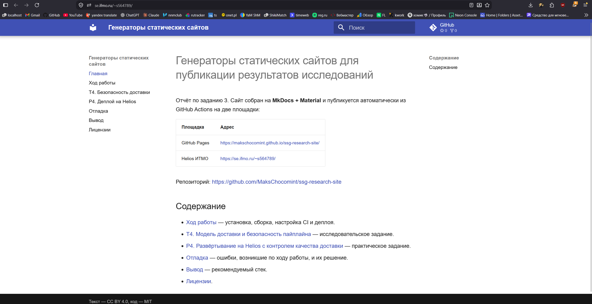
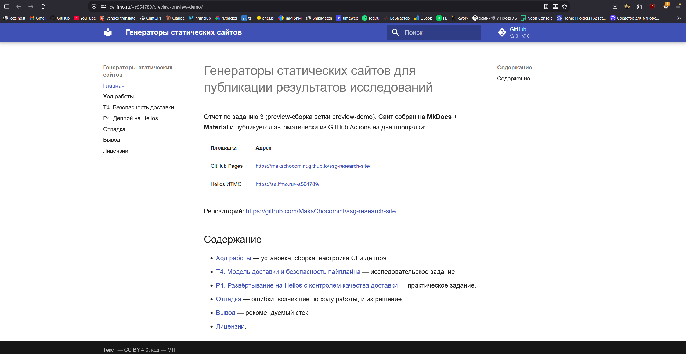
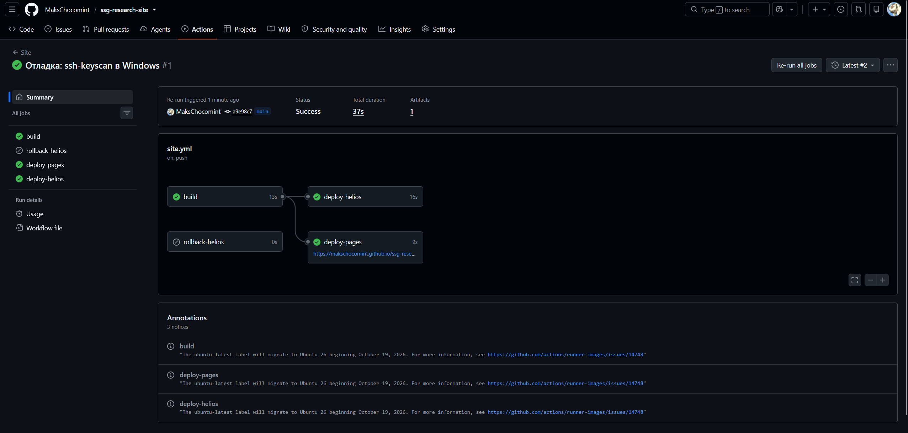
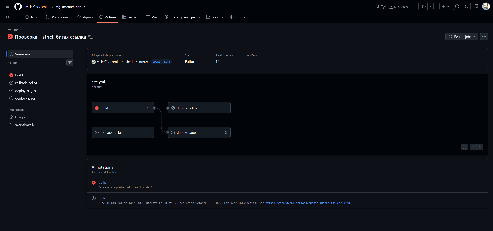
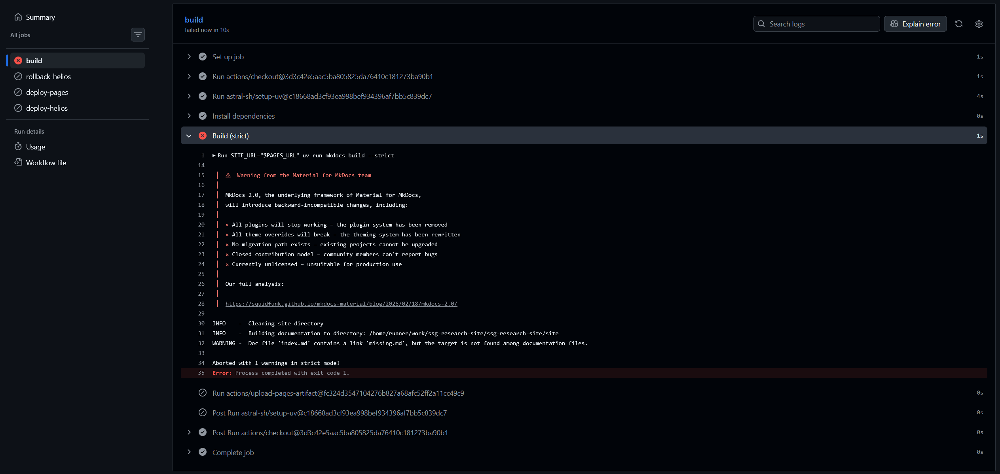

# P4. Развёртывание на Helios с контролем качества доставки

## Схема

```text
push в любую ветку
  └─ build ── mkdocs build --strict
       ├─ deploy-pages   (только main)  → GitHub Pages → healthcheck
       └─ deploy-helios  (все ветки)    → backup → rsync → healthcheck

workflow_dispatch с rollback=true (main)
  └─ rollback-helios → восстановить site-backup/main → healthcheck

pull_request
  └─ build (без деплоя: секреты из форков недоступны)
```

| Событие | Что происходит |
| --- | --- |
| `push` в `main` | Сборка, деплой на Pages и в корень `public_html` на Helios |
| `push` в другую ветку | Сборка, деплой на Helios в `public_html/preview/<ветка>/` |
| `pull_request` | Только сборка с `--strict` |
| Ручной запуск | Без флага — как push; с `rollback=true` — откат Helios |

## Deploy-ключ

Для CI создан отдельный ключ, личный ключ не используется:

```bash
ssh-keygen -t ed25519 -f helios_deploy -N "" -C "github-actions ssg-research-site"
```

Открытая часть добавлена на Helios в `~/.ssh/authorized_keys` с опцией `restrict`,
закрытая — в секрет репозитория `HELIOS_SSH_KEY`. Строка из `ssh-keyscan` — в секрет
`HELIOS_KNOWN_HOSTS` (см. [T4](t4.md#known-hosts)).
В логах GitHub Actions значения секретов заменяются на `***`.

## Healthcheck

После выкладки job запрашивает опубликованный адрес и проверяет три условия:

1. код ответа — 200;
2. в HTML есть контрольная строка «Генераторы статических сайтов»;
3. файл `version.txt` содержит хеш текущего коммита.

Третье условие нужно, потому что без него проверка проходит и тогда, когда на сервере
осталась старая версия. Если за 5 попыток условия не выполнились, job завершается
с ошибкой.

## Preview-сборки {#preview}

Ветка `main` публикуется в корень `https://se.ifmo.ru/~s564789/`, любая другая —
в `https://se.ifmo.ru/~s564789/preview/<ветка>/` (символы, кроме букв, цифр, `.`, `_`, `-`,
заменяются на `-`). Для каждой сборки `site_url` выставляется под её подкаталог.
При выкладке `main` используется `rsync --delete --exclude preview/`, чтобы не удалить
preview-сборки веток.

Проверка: ветка `preview-demo` с пометкой на главной странице.

| Адрес | `version.txt` |
| --- | --- |
| `https://se.ifmo.ru/~s564789/` (main) | `a9e98c7` |
| `https://se.ifmo.ru/~s564789/preview/preview-demo/` | `7b58dc0` |

После выкладки ветки корень сайта не изменился.





## Откат

Перед каждой выкладкой текущая версия копируется на сервере в
`~/site-backup/<ветка>/`. Откат — ручной запуск workflow
(**Actions → Site → Run workflow**, флаг `rollback`): job `rollback-helios` копирует
сохранённую версию обратно в `public_html` и проверяет, что сайт отвечает.

Демонстрация: _добавить после запуска отката_.

## Обрыв развёртывания на середине

`rsync` копирует файлы по одному, поэтому выкладка не атомарная: если соединение
оборвётся посередине, на сервере окажется смесь старых и новых файлов. Healthcheck
в этом случае не выполнится (упал предыдущий шаг), job будет красным. Исправляется
повторным запуском job — `rsync` докопирует только недостающие файлы — или откатом
на сохранённую копию. Резервная копия делается до начала выкладки, поэтому она не
повреждается.

## Сравнение GitHub Pages и Helios

Время по данным GitHub Actions (запуск `a9e98c7`, повторная попытка после включения Pages,
и запуск ветки `preview-demo`):

| Шаг | GitHub Pages | Helios (main) | Helios (preview) |
| --- | --- | --- | --- |
| Сборка для площадки | в job `build`, 1 с | 1 с | 2 с |
| Резервная копия | — | 2 с | 3 с |
| Доставка файлов | 6 с (`deploy-pages`) | 4 с (`rsync`) | 5 с (`rsync`) |
| Healthcheck | 0 с | 2 с | 3 с |
| **Весь job деплоя** | **9 с** | **16 с** | **22 с** |

Job `build` занимает 10–13 с, установка зависимостей из кэша uv — 0–1 с.
Весь запуск для `main` — 37 с.

| Критерий | GitHub Pages | Helios |
| --- | --- | --- |
| Время job деплоя | 9 с | 16 с (main), 22 с (preview) |
| Надёжность | Атомарная замена сайта, откат — повторный деплой старого коммита | Выкладка не атомарная, откат реализован вручную |
| Отладка | Только лог job, доступа к серверу нет | Можно зайти по SSH и посмотреть файлы и права |
| Секреты | Не нужны (OIDC) | SSH-ключ ко всему аккаунту |
| Preview веток | Нет (один сайт на репозиторий) | Есть, через подкаталоги |

## Текст workflow

```yaml
--8<-- ".github/workflows/site.yml"
```

## Скриншоты

### Успешный запуск



### Намеренно проваленный запуск

В ветке `broken-link` на главную добавлена ссылка на несуществующую страницу `missing.md`.



Лог шага `Build (strict)`:



Разбор: MkDocs нашёл ссылку на файл, которого нет среди страниц, и выдал `WARNING`.
В режиме `--strict` любое предупреждение — ошибка, поэтому сборка завершилась
с `Aborted with 1 warnings in strict mode!` и кодом 1. Шаг загрузки артефакта не выполнился,
а jobs `deploy-pages` и `deploy-helios` пропущены (`needs: build`) — сломанная версия
не попала ни на одну площадку.
