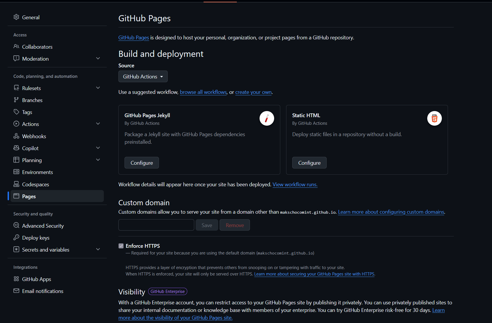

# Ход работы

## 1. Окружение и зависимости

Для управления окружением использовался [uv](https://docs.astral.sh/uv/): он сам ставит
нужную версию Python, создаёт виртуальное окружение `.venv` и фиксирует версии всех пакетов
в `uv.lock`.

```bash
uv init --bare --python 3.12
uv add mkdocs-material
```

Версия Python зафиксирована в `.python-version` (3.12), версии пакетов — в `uv.lock`.
В CI используется `uv sync --locked`: если lock-файл не соответствует `pyproject.toml`,
сборка падает, а не ставит другие версии.

В `.gitignore` добавлены `.venv/`, каталог сборки `site/` и кэши.

## 2. Каркас сайта и локальная сборка

Конфигурация — `mkdocs.yml`, страницы — каталог `docs/`.

```bash
uv run mkdocs serve            # предпросмотр на http://127.0.0.1:8000
uv run mkdocs build --strict   # сборка; предупреждения считаются ошибками
```

Режим `--strict` нужен в CI: без него битая ссылка даёт только предупреждение,
и сломанный сайт уходит в публикацию.

## 3. Базовый URL

Сайт публикуется в двух местах с разными адресами:

- GitHub Pages — `https://makschocomint.github.io/ssg-research-site/`;
- Helios — `https://se.ifmo.ru/~s564789/` (подкаталог пользователя).

В `mkdocs.yml` адрес берётся из переменной окружения:

```yaml
site_url: !ENV [SITE_URL, "https://makschocomint.github.io/ssg-research-site/"]
```

MkDocs строит ссылки между страницами относительными, поэтому сайт работает в любом
подкаталоге, а `site_url` влияет на `sitemap.xml` и канонические ссылки.
`use_directory_urls` оставлен по умолчанию (`true`): страницы доступны как `/t4/`,
Apache на Helios отдаёт `index.html` из каталога.

## 4. GitHub Pages

В настройках репозитория: **Settings → Pages → Source = GitHub Actions**.

Есть два способа публикации:

| | Push в ветку `gh-pages` (`peaceiris/actions-gh-pages`) | `upload-pages-artifact` + `deploy-pages` |
| --- | --- | --- |
| Куда попадает сайт | Коммит в отдельную ветку репозитория | Артефакт, который GitHub публикует сам |
| Права workflow | `contents: write` — запись во весь репозиторий | `pages: write`, `id-token: write` — только публикация Pages |
| История версий | Есть, в ветке `gh-pages` | Нет, хранится только последний деплой |
| Защита | Можно публиковать с любой ветки | Environment `github-pages` с правилами (только `main`) |

Выбран официальный способ: ему не нужно право записи в репозиторий, а сайт
не засоряет историю git.

На странице настроек Pages GitHub предлагает готовый workflow «Static HTML» — он
загружает файлы репозитория тем же `upload-pages-artifact` + `deploy-pages`. Здесь он не
подходит как есть: сначала нужно собрать сайт MkDocs, поэтому шаги взяты в свой workflow.



## 5. Helios ИТМО

Сайт выкладывается в `~/public_html` по SSH (порт 2222) через `rsync` с отдельным
deploy-ключом. Подробно — в разделе [P4](p4.md).

## 6. Проверка результата

После каждого деплоя workflow проверяет не «на глаз», а автоматически:

- код ответа HTTP равен 200;
- в HTML есть контрольная строка (название сайта);
- `version.txt` содержит хеш текущего коммита — значит, опубликована именно новая версия.

Поиск работает локально (индекс `search/search_index.json` лежит на сайте), для него
включены русский и английский языки. Формул на сайте нет, внешние шрифты Google Fonts
отключены (`font: false`), иконки темы встроены в HTML как SVG — поэтому сайт не
зависит от внешних CDN. Проверка — в разделе [T4](t4.md#no-cdn).

## 7. Лицензии

Код (конфигурация, workflow) — MIT, текст — CC BY 4.0. См. [Лицензии](license.md).
